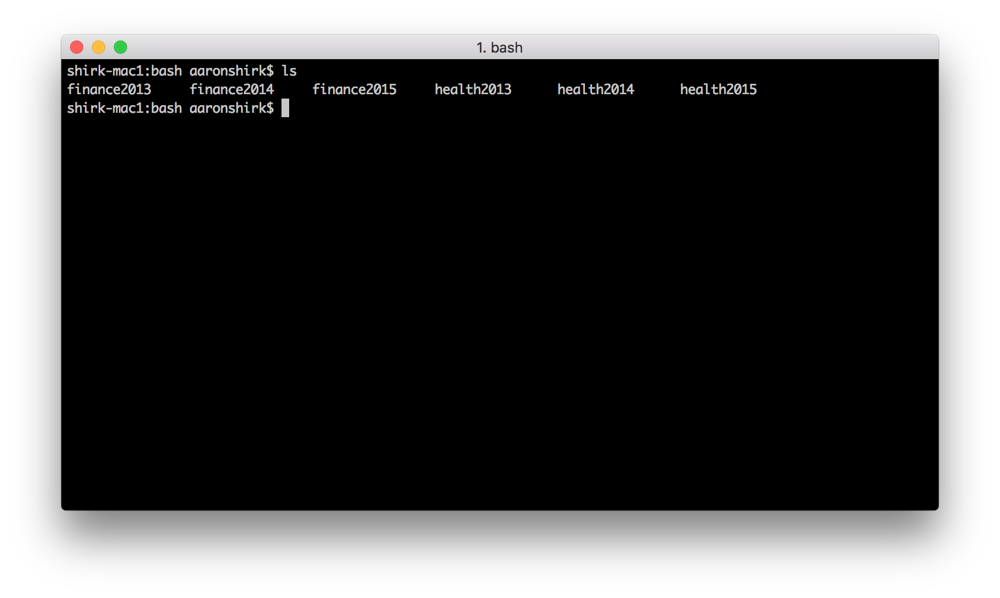
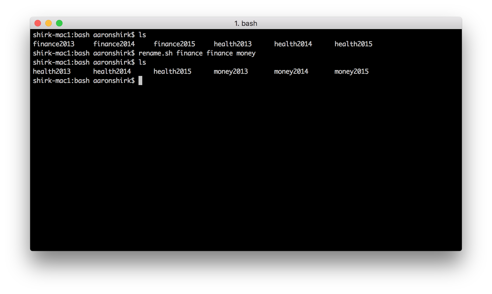
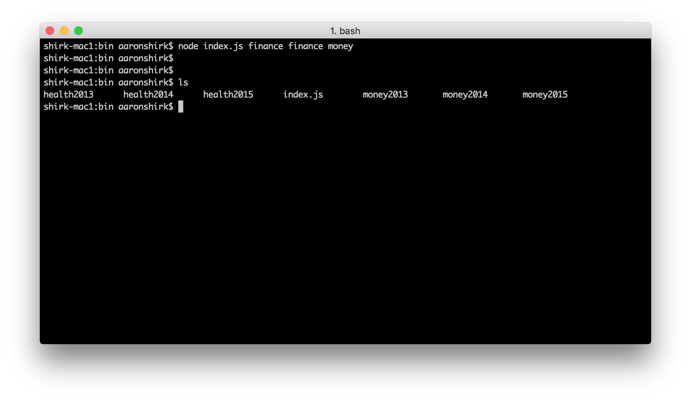
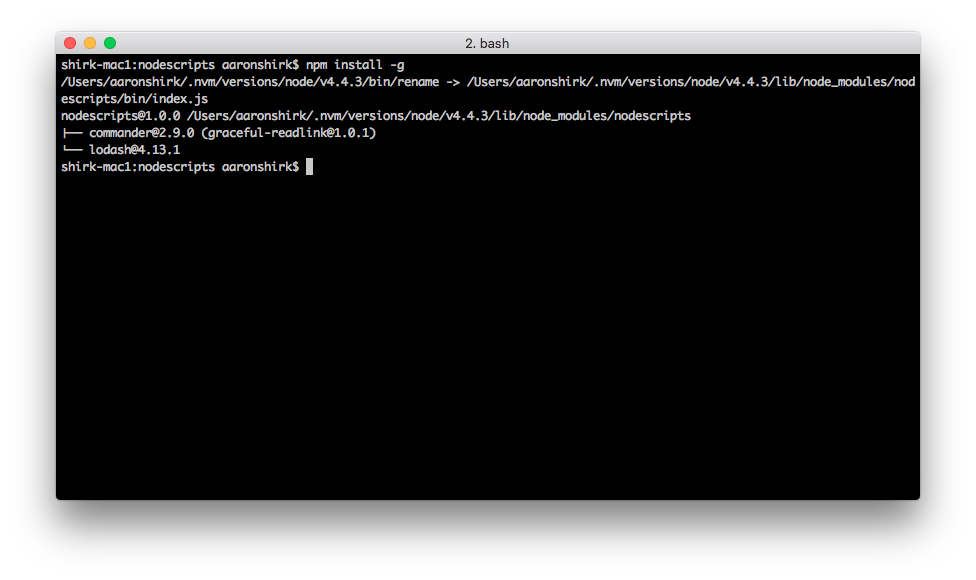
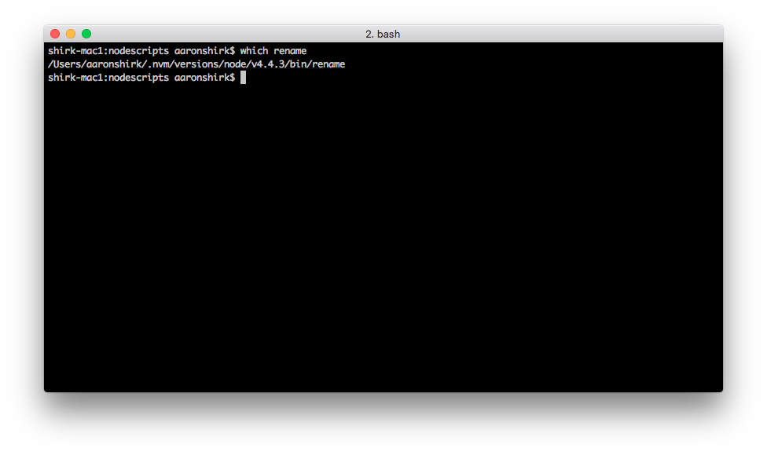
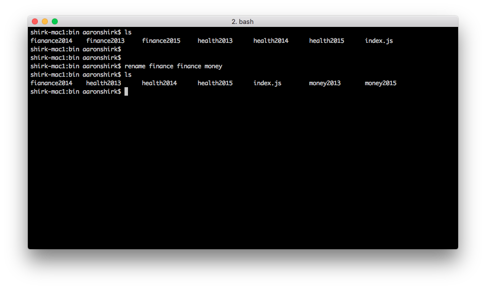
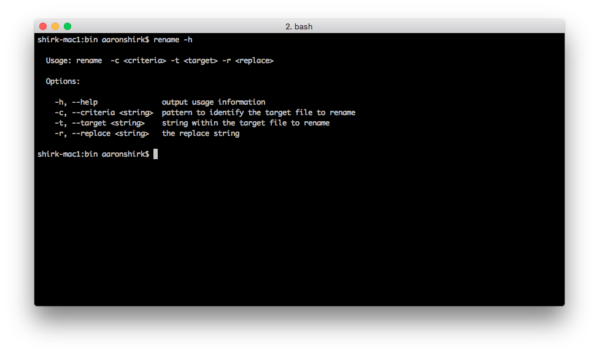

# Command-line Node.js... bye bye bash?

If I had to guess if **node.js** would every replace **bash** as a scripting language, I'd have to guess no.  Needless to say, it's a very powerful scripting language used and loved by many.  I certainly understand that.

That said, **bash** is a bit arcane in its syntax, it's not very easy to learn,  and unless you're a die-hard Unix guru or devops type, then **bash** may not be the tool you'd naturally turn to in a time of need.

So what do you do should you find yourself in a situation where you need to write a quick Unix shell script?  The obvious, and perhaps preferred, tool on the table is **bash**.  But we just admitted that we stink at writing **bash** scripts right? 

Fear not, for it's actually quite easy to write your shell script using **node.js**.  You can even install your **node** script so that it behaves just like a normal unix binary command-line utility such as **ls**, **grep**, and **curl**.  Let's see how to do this. 

First, here are the high level steps:

1. Create a project `npm init`
2. Write the node script
3. Pre-pend the shebang to "teach" the script to run like a command-line utility
4. Install the script
5. Test the script
6. Improve

# A Simple BASH Script

Suppose the task we want to solve is to rename files in a directory.  Our target command takes three parameters:

```bash
rename <criterion> <filePatternMatch> <replaceString>
```

* **criteria**:         the pattern to identify the target file(s) to rename
* **targetSubtring**:    the string within the target file(s) to rename
* **replaceString**:     the replacement string

The bash script looks something like this:

```bash
#!/bin/bash
 # rename.sh
 # basic file renamer

 criteria=$1
 targetSubstring=$2
 replaceString=$3

 for i in $( ls *$criteria* );
 do
     echo $i
     src=$i
     tgt=$(echo $i | sed -e "s/$targetSubstring/$replaceString/")
     mv $src $tgt
 done
```

To see this in action, assume we have some files in a directory that we are going to archive but before we do we want to tweak the names. The directory currently looks like this:



Assume also that we want to rename the word "finance" to "money". To do this the command will be as follows (assuming *rename.sh* is in the $PATH):

```bash
rename.sh finance finance money
```

Once the command runs, the files have been renamed and the directory listing should look like this:


Great, that's what we wanted.  The problem now is the fact that the script is written in **bash**.  Let's fix that by rewriting the script in **node.js**.

# A Simple Node.js Script

Start by creating a **node** project (`npm init`), create an index.js file, and code up the logic.  When done the first draft of the script looks something like this. 

```javascript
#!/usr/bin/env node
'use strict';

const fs = require('fs'),
      _ = require('lodash');

const input = process.argv.slice(2),
      criteria = input[0],
      targetSubstring = input[1],
      replaceString = input[2],
      cwd = process.cwd();

fs.readdir(cwd, function(err, files) {
  if (err) {
    return console.log('   +++ error reading files');
  }
  const targetFiles = _.filter(files, (f) => f.includes(criteria));
  _.each(targetFiles, function(file) {
    let newFilename = file.replace(targetSubstring, replaceString);
    fs.rename(file, newFilename);
  });
});
```

A couple things to note in this scripts:
* *lodash* and *fs* are used for heavy-lifting
* *params.argv* is used directly for parsing command-line arguments
* `#!/usr/bin/env node` is used to "teach" the script to act similar to a regular command-line binary (more on this in a moment)

Now run and test the command:
```node
node index.js finance finance money
```

And once again, the files are renamed and the directory should look like this:



So far so good, the script successfully renamed the files from *finance* to *money* and the command works. But, before we go ahead and publish this for all to use, let's now look at a couple finer points.

# Shebang node/env

Line #1 of the new **node.js** script `#!/usr/bin/env node` is important.  Normally when developing and debugging a node script, we'd run and test the script by executing **node** directly:

`node <script> <args>`

In this case, we don't want to run the **node** executable explicitly.  The whole point of this exercise it to write and run **node** scripts so they look, smell, and behave just like any other command-line binary: 

`rename <param1> <param2> <param3>`

Line #1 in the script is what makes this possible.

The `/usr/bin/env` portion of this directive invokes the **env** shell command on the target machine.  In short this is saying to find **node** in the path and use it to run this script.

### Shebang Platform Issues

The one downside of the hard-coded 'shebang' is that the **env** command is not necessarily located at `/usr/bin/env` an all Unix platforms.  For instance there are some reports on the internet that this may not work on Ubuntu systems.  

Just something to keep in mind if your scripts will be shared in a distributed fashion across different platforms.  As always, we'll need to consider our user base.

# Script Installation

At this point the script is developed and it's time to install it.  Not surprisingly **npm** provides an easy way to do this.  Simply include the **bin** property in the project's **package.json** file providing the name of the script once it's installed and **npm** will automatically install it in the right place. 

For example, here is the **package.json** for our sample rename command:

```json

  "name": "nodescripts",
  "version": "1.0.0",
  "description": "Sample node scripts",
  "main": "index.js",
  "scripts": {
    "test": "echo \"Error: no test specified\" && exit 1"
  },
  "bin": {
    "rename": "./bin/index.js"
  },
  "author": "ashirk",
  "license": "ISC",
  "dependencies": {
    "commander": "^2.9.0",
    "lodash": "^4.12.0"
  }
}
```

Note the **bin** property has a key `rename` and value `./bin/index.js`. The key represents the name of the command once it's installed.  `./bin/index.js` is where the source file is located in the current project. 

Test it out by running `npm install -g`.  


In my particular case I've chosen to use **nvm** (node version manager) to manage the **node.js** installations on my system.  As a result `npm install -g` installs the script under `/Users/aaronshirk/.nvm` sub-directory.  Since I've manually added this to the $PATH in my **.profile** the script is executable anywhere.

If you're not using **nvm** then your script will be installed elsewhere, typically `/usr/local/bin`.  However it depends on how you've installed **node.js** on your system. 

One quick way to confirm everything is working is to use the command `which rename` to see if the script if visible on the $PATH.  If it returns a positive response then the installation was successful.  


Assuming everything looks good, we can now run the rename command anywhere on our system as if it were a typical command-line binary.  Testing this on our system yields the expected results:

`rename finance finance money`


Awesome, we now have a fully functioning **node.js** binary. At this point we can use it as is, or we can tweak and improve it to make it a little more user friend.  As it's currently written, this script is very basic and offers no usage information.  One aspect that could use a little improvement is parsing and processing command-line arguments.  Let's take a look at one option that can help improve this.


# Commander.js === better command-line arguments

In the first draft of our script above we used `process.argv` directly to obtain the arguments from the command-line.  [Commander.js](https://github.com/tj/commander.js/) is one tool that can greatly ease this process.

We've already included **commander** in our package.json above.  Here is a new version of our script now using **commander** to process the script arguments.

```javascript
#!/usr/bin/env node
'use strict';

const fs = require('fs'),
      _ = require('lodash'),
      program = require('commander'),
      cwd = process.cwd();

program
  .usage(' -c <criteria> -t <target> -r <replace>')
  .option('-c, --criteria <string>', 'pattern to identify the target file to rename')
  .option('-t, --target <string>', 'string within the target file to rename')
  .option('-r, --replace <string>', 'the replace string')
  .parse(process.argv);

if (!program.criteria || !program.target || !program.replace) {
  program.help();
  process.exit(1);
}

let criteria = program.criteria,
    targetSubstring = program.target,
    replaceString = program.replace;


fs.readdir(cwd, function(err, files) {
  if (err) {
    return console.log('   +++ error reading files');
  }
  const targetFiles = _.filter(files, (f) => f.includes(criteria));
  _.each(targetFiles, function(file) {
    let newFilename = file.replace(targetSubstring, replaceString);
    fs.rename(file, newFilename);
  });
});
```

Now the script is a little more resilient and a bit more professional.  To run it we would now type:

`rename -c finance -t finance -r money`

In addition to collecting command-line arguments, another really nice feature of **commander** is that it provides a default *help* parameter for the script, providing nicely formatted usage information out of the box.



# Summary

**Bash** is no doubt a powerful scripting language, however it's not the only way to create useful scripts.  Even if you know very little **bash**, you can still create powerful scripts with **node.js**.  At the very least, it's another option in your toolbox that you can consider.


