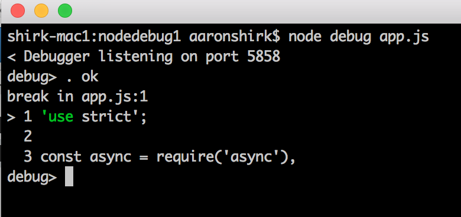
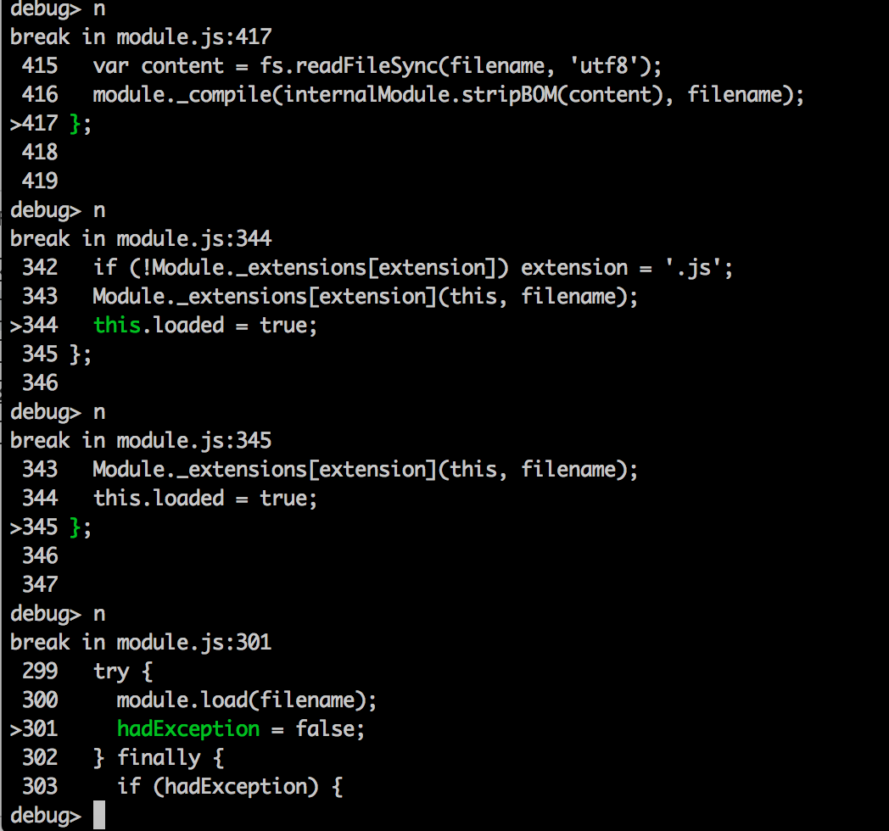
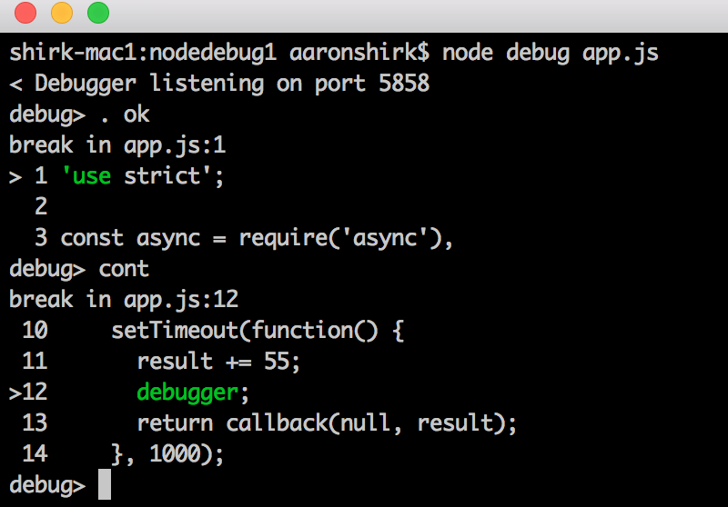
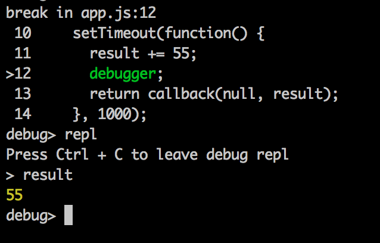
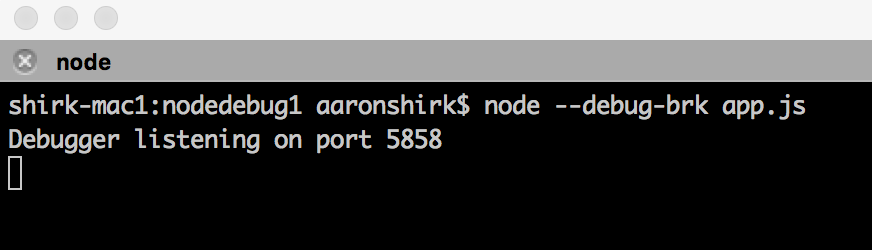
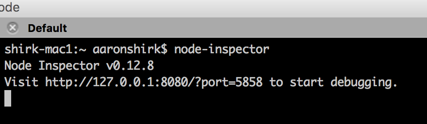
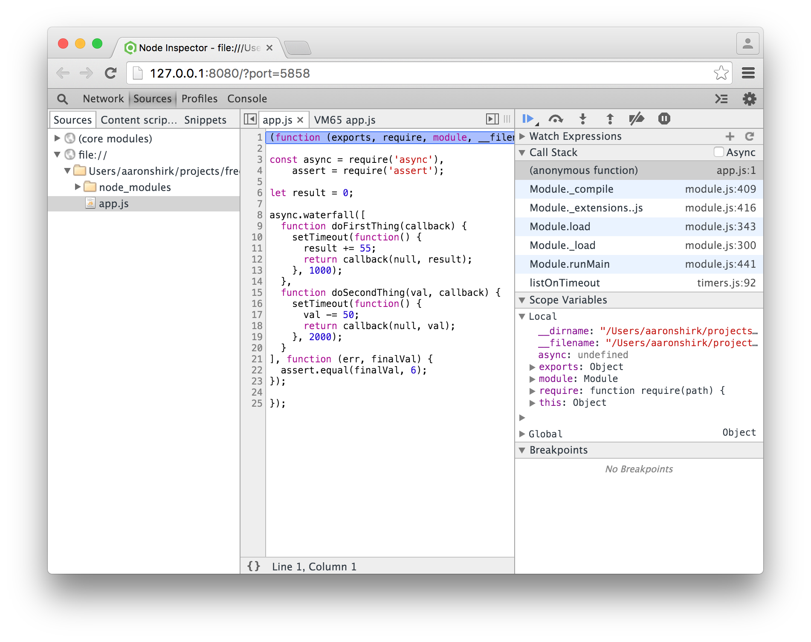
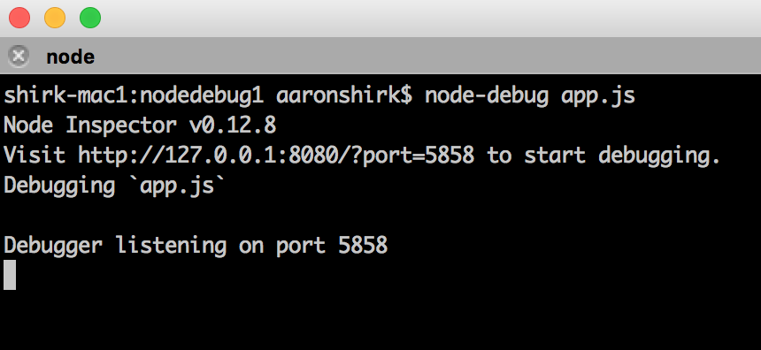
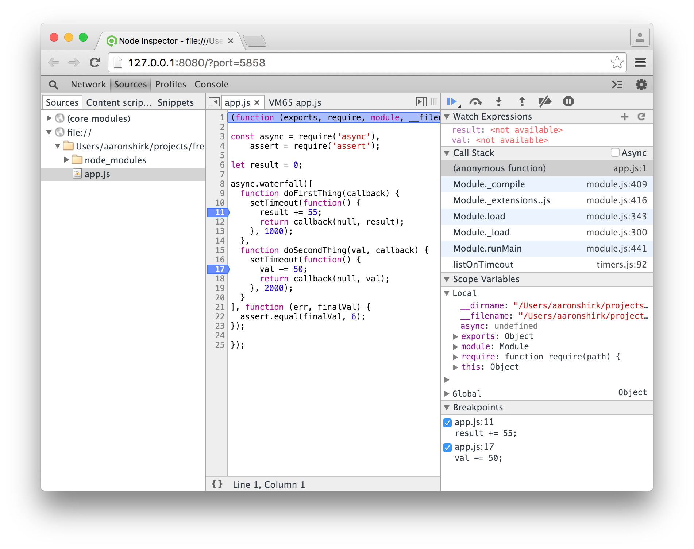
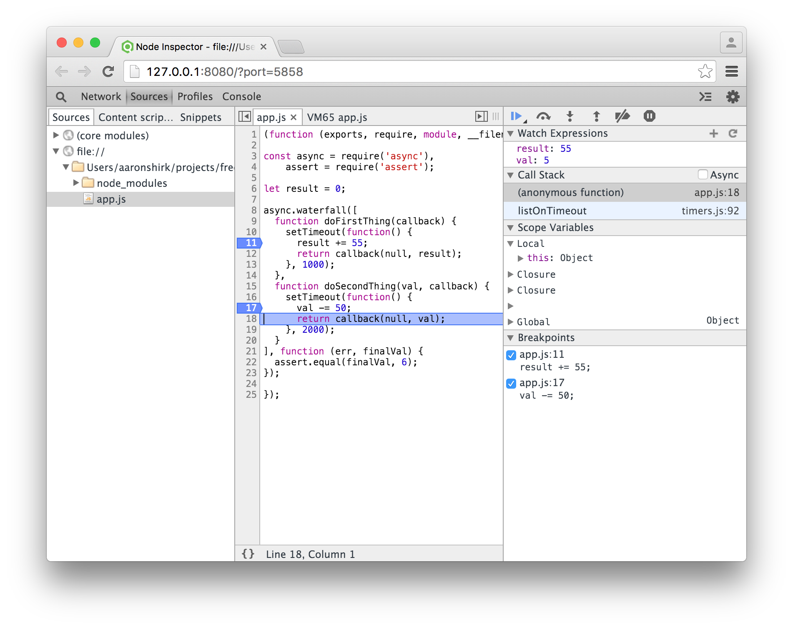

# Two Handy Tools for Simple Node Debugging

The seasoned developer hones his or her craft over many years, and knows how to use the right tools at the right times. This article looks at two simple tools you can use to boost your debugging efficiency.

### Console.log

First, when it comes to the Node.js language, it's important to acknowledge our tried-and-true friend, **console.log**.  No doubt this is the first debugging tool all JavaScript and Node.js developers use out of the gate. Yet, once a code base starts to become even remotely complicated, **console.log** gets tedious.  Fortunately, Node.js core itself ships with its very own built-in command-line debugger.

### Core Node.js Debugger

Suppose you have the following script:

```javascript
// app.js
'use strict';

const async = require('async'),
    assert = require('assert');

let result = 0;

async.waterfall([
  function doFirstThing(callback) {
    setTimeout(function() {
      result += 55;
      return callback(null, result);
    }, 1000);
  },
  function doSecondThing(val, callback) {
    setTimeout(function() {
      val -= 50;
      return callback(null, val);
    }, 2000);
  }
], function (err, finalVal) {
  assert.equal(finalVal, 6);
});
```

When this code snippet executes, it throws an error and we want to debug this to inspect the value of the result as it moves through the async calls.

To use the Node debugger, invoke this script with the debugger:
`node debug app.js`



The debugger starts, indicates that it is listening on port 5858, and is breaking at line 1. From here, it's easy to step through the code as you would in any normal debugging tool using the following debug commands:

* cont, c - Continue execution
* next, n - Step next
* step, s - Step in
* out, o -  Step out
* pause - Pause running code

### Debugging Async Code

Node.js run asynchronously, and in our **app.js** snippet, we are running async code. For the uninitiated, debugging async code can be tricky.  For instance, if you were to step through this code as you would in a non-async language (i.e. JavaScript), you will quickly find yourself deep inside Node's core async code, as shown below.



In this case, I've stepped through several lines of code and now the debugger is looking at **module.js line 301**.  This is not our application code, and the logic I was trying to debug is temporarily lost - at least until I find my way out.  But I don't know if that's five lines or 100, and this just makes things more confusing.  The good news is that it's easy to remedy this situation by using breakpoints.  

### Using Breakpoints

The best way to avoid getting tangled deep within core Node functions is to set breakpoints at strategic points within code.  To do this using the Node command-line debugger, just insert the `debugger;` directive directly into your source at the desired line.

```javascript
// app.js
'use strict';

const async = require('async'),
    assert = require('assert');

let result = 0;

async.waterfall([
  function doFirstThing(callback) {
    setTimeout(function() {
      result += 55;
      debugger;
      return callback(null, result);
    }, 1000);
  },
  function doSecondThing(val, callback) {
    setTimeout(function() {
      val -= 50;
      debugger;
      return callback(null, val);
    }, 2000);
  }
], function (err, finalVal) {
  assert.equal(finalVal, 6);
});
```

Here I've inserted `debugger` at lines 12 and 19. Next, fire up the debugger again and use the `continue` command to move the debugger to the first breakpoint. 



Here the debugger is indicating that it paused at line 12.  At this point, it's easy to inspect variables using the built-in debug **repl** command. Issue the following commands to view the value of the **result** variable at this point:

* `repl`
* `> result // inspect the variable`
* `CTRL-C   // exit out of the debug repl and go back to debug`



Here you can see the **result** variable has a current value of 55. Pretty nifty! 

So you've just received a whirlwind tour of the built-in core Node debugger.  It's a full-featured debugger at your fingertips, invoked in seconds directly from the command-line.  Next, let's take a look at our second debugging tool, **Node Inspector**.

# Node Inspector

**Node Inspector** is a debugging interface that provides a similar debug experience to what you might find in a commercial IDE.  It's based on WebKit and works in Chrome or Opera.  Certainly, the Node core command-line debugger is handy, but Node Inspector can offer a significant improvement in terms of usability.  It operates just like Chrome Developer Tools, providing an immediate boost in productivity.

### Basic Features

* List of source files in the target application
* Set breakpoints
* Step over, step in, step out, and resume
* Variable inspection
* Watch lists
* Evaluate expressions

### Installation

There are a couple of different ways to get Node Inspector up and running. First, simply install using NPM:

```javascript
npm install -g node-inspector
```

### Start Debugging (Method #1)

The first method for launching Node Inspector requires two commands, followed by launching Chrome.

1. `node --debug-brk app.js`

This assumes, of course, that app.js is your app entry point.  The **--debug-brk** starts the Node debugger listening on port 5858, and then immediately breaks on the first line of the application, waiting for you to take the next step and launch the inspector.



2. `node-inspector`

This starts the Node Inspector interface, and then you are kindly reminded to start your Chrome browser at http://127.0.0.1:8080/?port=5858.



3. Copy and paste that url into Chrome

This opens the Node inspector interface and connects to the running app debugger on port 5858.  It then loads the application source files, allowing you to easily select which source files
you want to inspect and set any breakpoints.


As you can see, the **app.js** source is loaded on the left pane, the code is displayed in the center, and call stack, watch lists, variables, etc. are listed on the right. At this point, it's simply a matter of setting breakpoints and stepping through the code. 

Before we do that, though, there is a second method to get this up and running a little more quickly. 

### Start Debugging (Method #2)

This method of debugging is done in a single command.

1. `node-debug app.js`

This performs all three steps in Method #1 for you. Why even mention Method #1, then? Mainly because it's often useful to know all the moving parts just in case something doesn't work exactly as expected. Your command line will look similar to the following, and your browser will open to the same view listed above. 




### Set Breakpoints

To set breakpoints, click the source file you are interested in debugging, and then select the source lines.  For this example, let's again select lines 11 and 17 so we can inspect variables within the async functions.


In addition to breakpoints, I've also set up watch expressions in the upper right for the **result** and **val** variables.  Resume execution and inspect the values.


The image above shows that I've stepped through the two breakpoints and stopped on line 18, and the values of the variables are now available.  In addition, I can hover the mouse over the **val** variable, for instance, and the expression is evaluated.


# Takeaway

Yes, there will always be a place for **console.log**, but with just a couple additional mouse clicks and a few keystrokes, it's possible to have capable and easy-to-use debuggers assisting you as your code base grows. An added bonus is that you don't need an IDE to use either of these - they come for free. Happy debugging!

