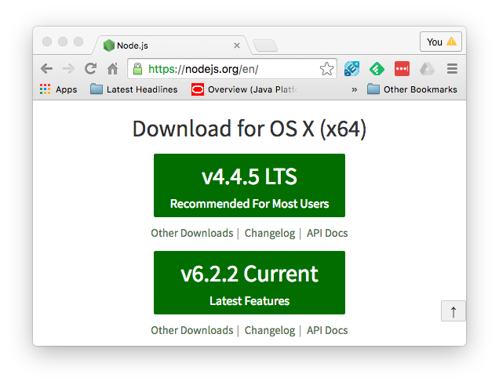
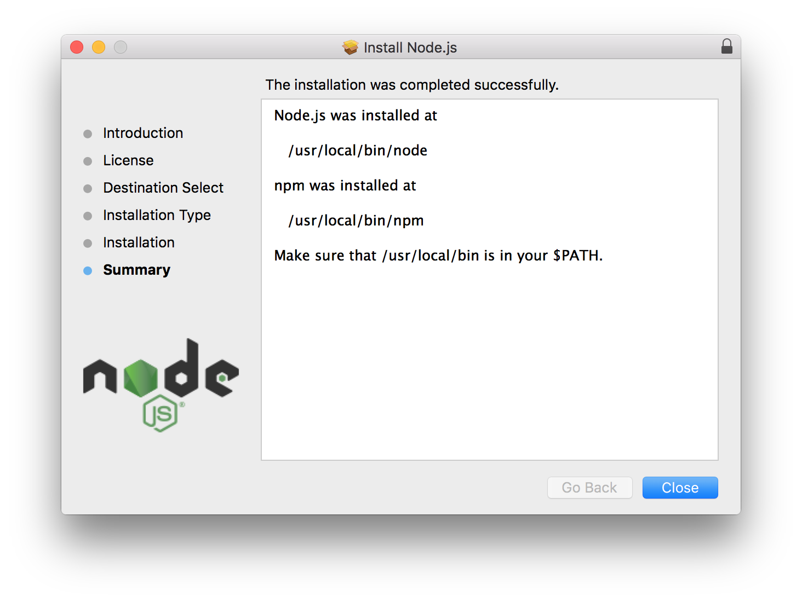
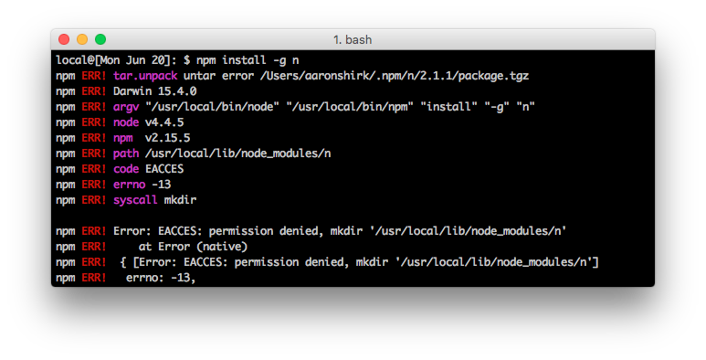
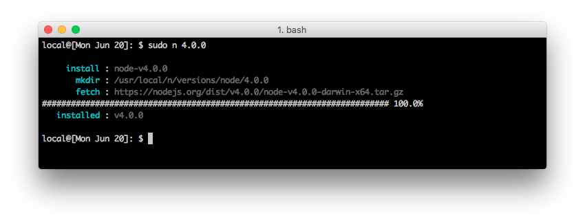
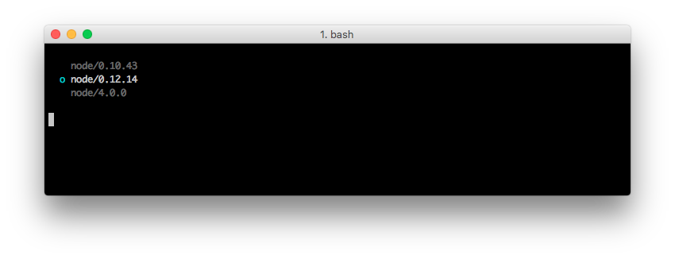
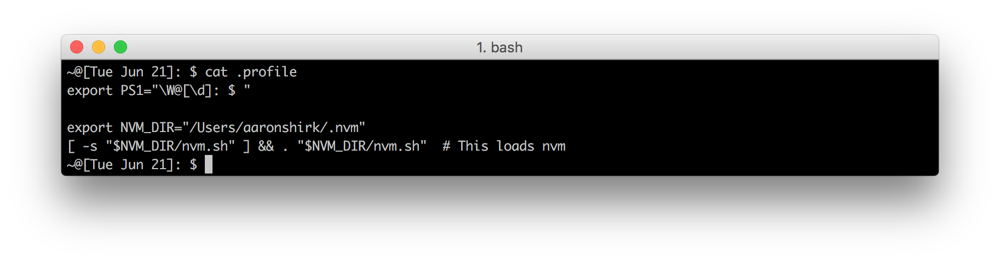
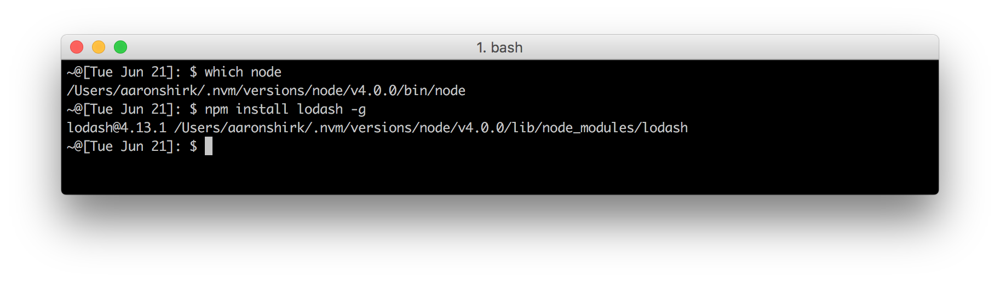

# Tips For Easy Node Versioning

It's pretty easy to install and maintain one version of **node.js** on your system.  What happens though when you find that you are developing multiple applications and each requires a different version of **node**?  Depending on your situation, this can quickly become a real pain.

In this article we'll look at a couple common ways to manage multiple **node** versions and you can pick which one works best for you.  The examples in this article are demonstrated on Mac-OSX; the concepts, however, should easily transfer to other Unix based systems.

First let's review a typical way to install **node**:

# The basic node.js install

The typical way to install **node** the first time around is to go to [nodejs.org](http://nodejs.org/en/) and download the latest installer, run the installer, and follow the prompts.



Once the installer is finished installing, it kindly tells us where the installation is located on your system.  It's useful to make note of this.


By default **node** and **npm** are installed at `/usr/local`.  While there is nothing inherently wrong or unusual about this install location, there are a couple drawbacks to be aware of.

First, `/usr/local` is a system level directory that is typically owned by the **root** user.  This means that anytime you want to install an **npm** package globally you have to use the `sudo` command to install properly with all the correct permissions.  For instance:

```
sudo npm install lodash -g
```

The second drawback appears when it comes time to manage a second version of **node**.  As it happens, it can be pretty difficult if you try to do this on your own.  Fortunately there are better ways. 

# Introducing n
`n` is a simple **node** versioning tool that aims for extreme simplicity.  The easy way to install `n` is to first install **node** as we did above, and then use **npm** to install `n`.

```
npm install -g n
```

Oh but wait, this will breaks since we're installing `n` globally. 


Let's try this again, this time with `sudo`.

```
sudo npm install -g n
```

Once `n` is installed, simply install additional versions of **node** using the form `n <version>`.  Again, this may require `sudo` since this is installing **node** versions in `/usr/local/`.

```
sudo n 0.12.14
sudo n 0.10.43
sudo n 4.0.0
```



You can view the currently installed versions of **node** by running `n`, then use the Up-arrow/Down-arrow keys to select the version you want to use. 



Finally, some additional handy `n` commands include:
* `sudo n latest`  - install latest node release
* `sudo n stable`  - install or active latest stable node release
* `sudo n rm <version ...>` - Remove listed version(s)


### Broken NPM

One caveat--once you install a new version of **node**, you are still using the original version of **npm**.  That version of **npm** may not be compatible with the version of **node** you are now using via `n`.  

To fix this run:
```
curl -0 -L http://npmjs.org/install.sh | sudo sh
```

So far `n` looks very promising.  It's simple, clean, and easily reduces the pain associated with managing multiple **node** versions.  However, we are still left with the drawback that we have to use `sudo` to install anything globally.  Fortunately there is another way to do what `n` does, while also solving this issue.  

# Introducing nvm
`nvm` is a bash script that helps manage multiple **node** versions.  Installation is very simple but if you have a system level installation of **node**, it's highly recommended to remove that first: [fully unintall node + npm](http://stackoverflow.com/questions/11177954/how-do-i-completely-uninstall-node-js-and-reinstall-from-beginning-mac-os-x).

Once your system is clean, install nvm using either cURL or wget:

```
curl -o- https://raw.githubusercontent.com/creationix/nvm/v0.31.1/install.sh | bash

wget -qO- https://raw.githubusercontent.com/creationix/nvm/v0.31.1/install.sh | bash
```

The script clones the nvm git repo to `~/.nvm/` and adds a source line to your local profile.


Now simply source your profile (or relaunch the terminal window) and verify the nvm installation.

```
. ~/.profile
command -v nvm
```

If you get a response then nvm is installed and ready to use. To install new versions of **node** use the `nvm install` command.
```
nvm install 4.0.0
```
Since this is the first version of **node** installed, nvm automatically sets this as the default version.  This means that when you open a new terminal window, this version of **node** will be the one that will execute by default.  Now if you type `which node` you will see the version of **node** located in `~/.nvm/version/node/v4.0.0/bin/node`.

This is where nvm departs from `n` and other system level installations of **node**.  Here **node** is installed in your local directory, and not under root.  As a result, to install an **npm** package globally you only have to issue `npm install lodash -g` for example (without using `sudo`).  And finally, that pesky issue of having to always use `sudo` to install an **npm** package globally is resolved.



To install **node** using handy aliases:

```
nvm install node    // latest vesion of node
nvm install iojs    // latest version of io.js
```
To run a specific version of **node** in a terminal session:

```
nvm use 5.0
```
To list the versions of **node** on your system:

```
nvm ls
```
To remove a **node** version

```
nvm uninstall 4.0.0
```
To set a new default **node** version:

```
nvm alias default 5.0.0
```

Finally, use `nvm --help` for the full list of commands. 


# Summary

Managing multiple **node** versions can be painful but it doesn't have to be.  Two tools, `n` and `nvm`, are both simple and effective at handling this messy work for you.  All it takes is about 5 minutes to get up and running and you don't have to sweat this any more, no matter which tool you wind up using.

